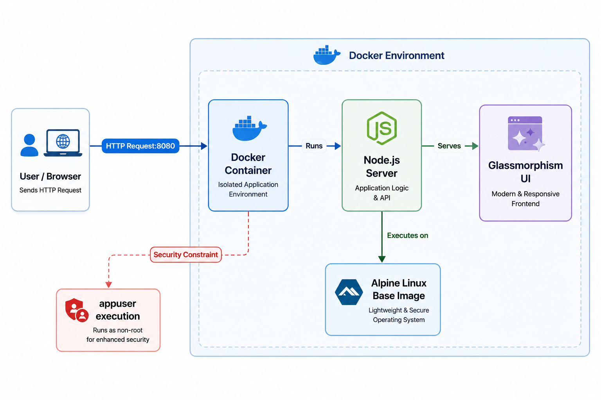
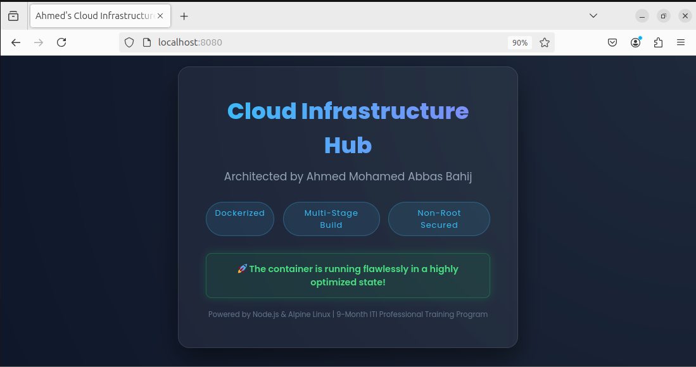
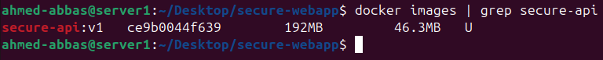
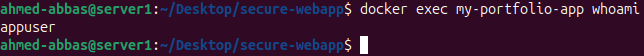

# 🛡️ Secure & Optimized Dockerized Web App


## 📌 Project Overview
This repository contains a production-ready, highly optimized, and secure Docker configuration for a modern web application. It demonstrates strict Cloud Infrastructure best practices for containerization, focusing on minimizing attack surfaces, reducing image sizes, and delivering a premium user interface.

## 📂 Repository Structure
```text
.
├── public/
│   └── index.html         # Custom Glassmorphism UI
├── images/
│   ├── ui-screenshot.png
│   ├── size-screenshot.png
│   ├── security-screenshot.png
│   └── project-diagram.png
├── Dockerfile             # Multi-stage & Secure build instructions
├── server.js              # Express.js server logic
├── package.json           # Node.js dependencies
├── .dockerignore          # Build context optimization
└── README.md              # Project documentation

```

## 🏗️ System Architecture

<p align="center">
  
  <br>
  <em><b>Figure 1:</b> System Architecture Diagram </em>
</p>

## 💡 Technical Decisions (Why this approach?)
* **Why an Alpine Base Image?** To minimize the attack surface and significantly reduce the final image size compared to standard Debian/Ubuntu bases.
* **Why Multi-Stage Builds?** To ensure build dependencies and package managers are completely excluded from the production image, leaving only the compiled, necessary artifacts.
* **Why a Non-Root User?** Running as `appuser` prevents privilege escalation attacks. If the container is compromised, the attacker does not gain root access to the host environment.
* **Why `.dockerignore`?** To keep the build context clean, speeding up the build process and preventing sensitive local files or large directories (like `node_modules`) from bloating the image.

## 📸 Project Showcase

### 1. The Secure Web Interface
*A modern, glassmorphism UI served directly from the optimized container.*


### 2. Optimization Proof (Minimal Image Size)
*The multi-stage build reduced the Docker image size to under 170MB, ensuring faster deployments and lower storage costs.*



### 3. Security Proof (Non-Root Execution)
*Executing `whoami` inside the running container proves it securely operates under the restricted `appuser` account instead of the default root.*



## 🚀 Getting Started (Full Guide)

### Prerequisites
* Docker Engine installed and running.
* Git installed.

### Step-by-Step Installation

1. Clone the Repository:
```bash
git clone https://github.com/Ahmed-Abbas-1/docker-security-best-practices.git
cd docker-security-best-practices
```
2. Build the Docker Image:
```Bash
docker build -t secure-api:v1 .
```
3. Run the Container:
```Bash
docker run -d -p 8080:8080 --name my-portfolio-app secure-api:v1
```
4. Verify the Application:
Navigate to http://localhost:8080 in your browser to see the live UI.

**Architected by:** Ahmed Mohamed Abbas Bahij

[](https://www.linkedin.com/in/ahmedabbas99)

Cloud Infrastructure & DevOps Engineer 
